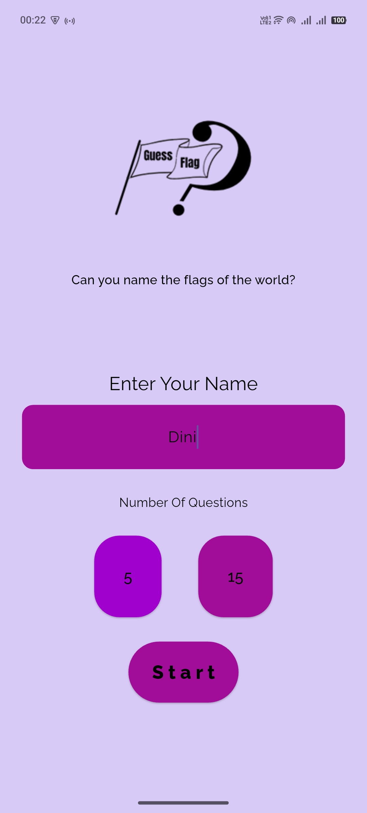
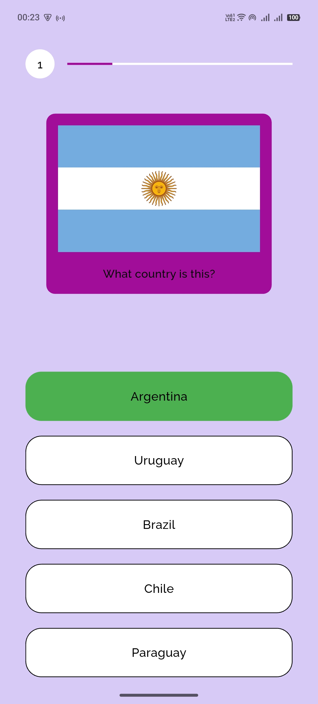
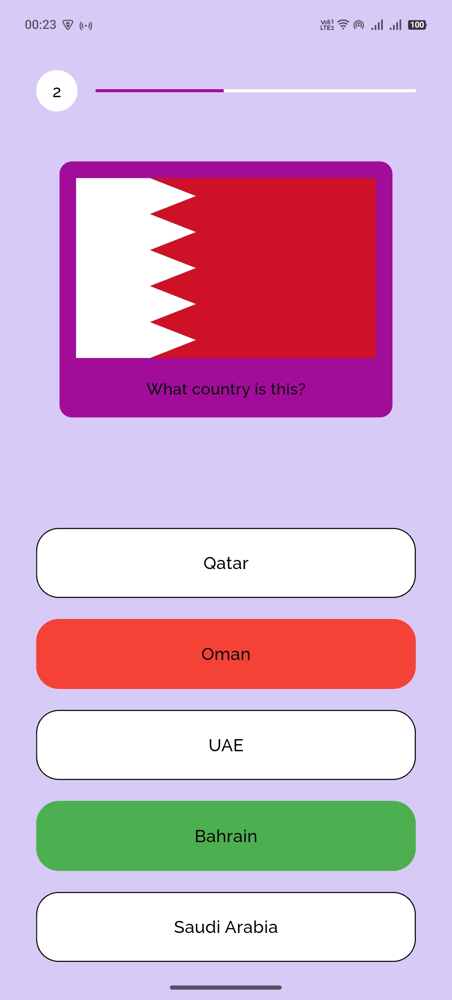
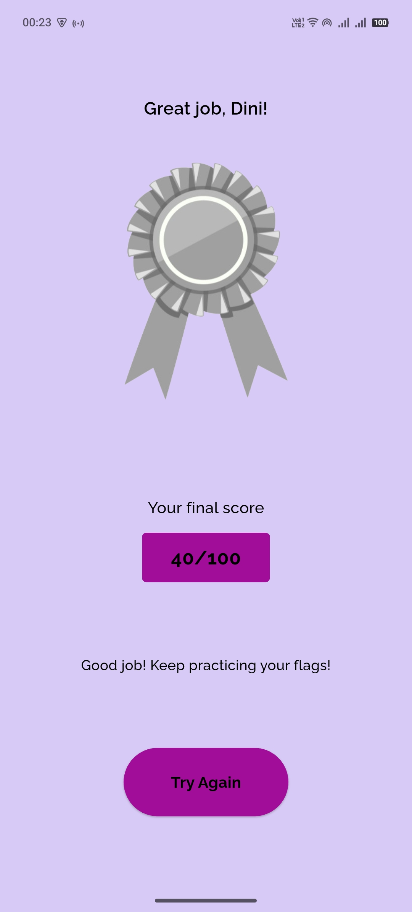
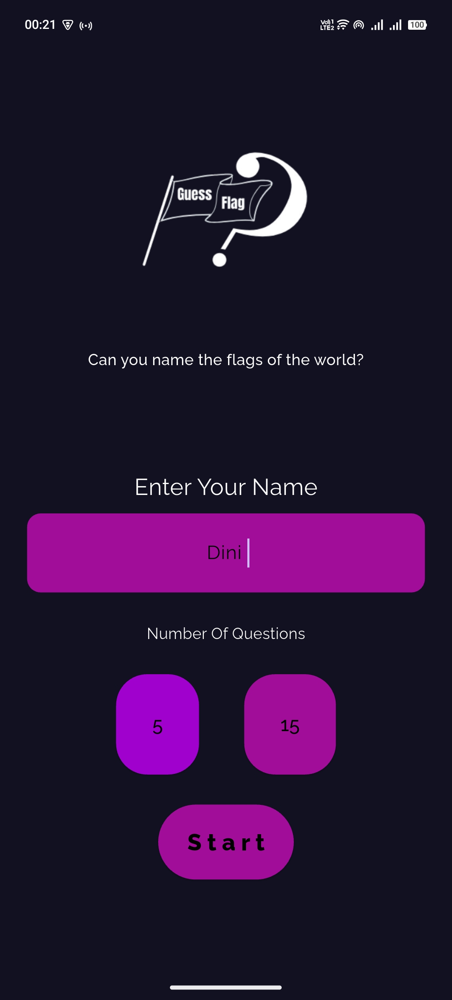
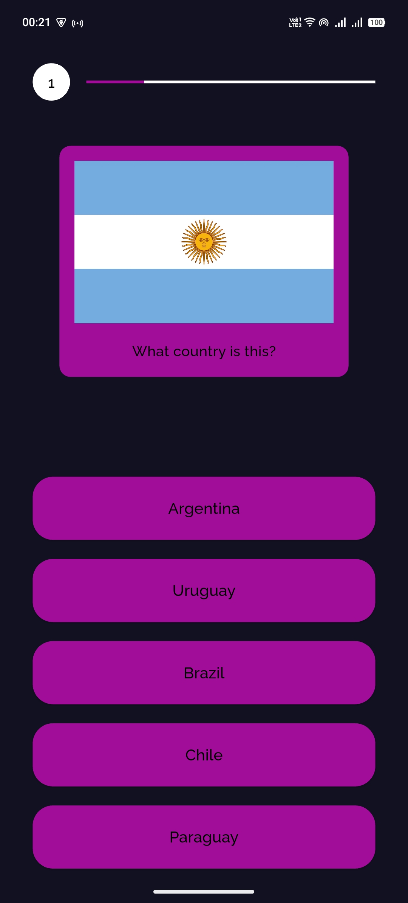
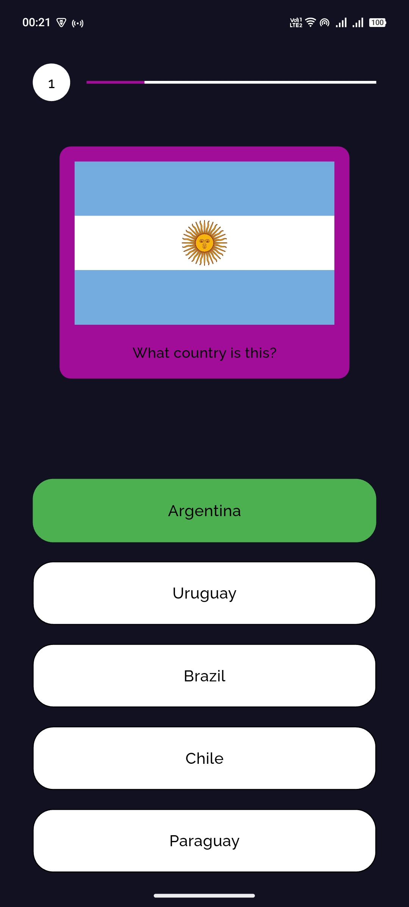
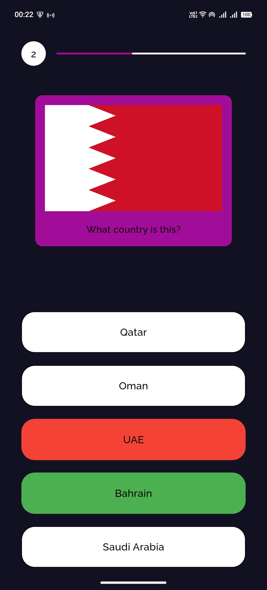
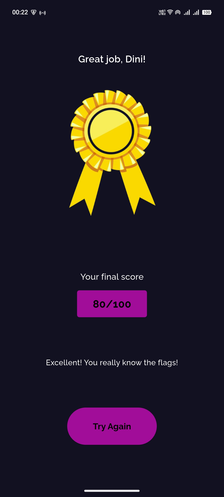

Nama : Dini Sahfitri 

Nim : 231401033 

Lab 5 Pemrograman Mobile

##GuesstheFlag

GuesstheFlag is an interactive quiz application that challenges players to identify flags from countries around the world.
The app is built with Flutter, featuring a clean and responsive design that automatically adapts to the device’s light or dark theme.
Players can enter their name, choose the number of questions, and see their final score displayed at the end of the quiz.

**Credit**
- **Font:** Raleway [https://fonts.google.com/specimen/Raleway](https://fonts.google.com/specimen/Raleway)  
- **Flags picture:** [CountryFlags.com](https://www.countryflags.com/)  
- **Logo aplikasi** dibuat menggunakan elemen dari [Canva](https://www.canva.com/)

**Application display:**
**system theme light mode **
**Main user interface display:**

**system theme dark mode**

  
  
  
  
  

---
**system theme dark mode**

  
  
  
  
  

**Mockup**
Mockup desain aplikasi dapat dilihat di Figma:  
[ Lihat desain di Figma](https://www.figma.com/design/zA7HYIt2FONQ9KJGnWmY3Q/GuesstheFlag?node-id=0-1&t=1jJ21NJKZgLjFZ9C-1)  

